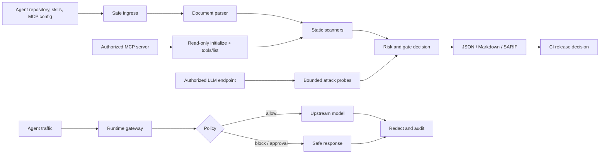

# Argus architecture

This is the smallest useful mental model for the project. The scanner is a
release gate; the gateway is an optional runtime control.

## Trust boundaries

- Repository files, skills, tool descriptions, and model responses are
  untrusted input.
- Static ingestion never runs repository hooks or launches discovered commands.
- MCP probing is a separate explicit operation. It launches or contacts only
  the command or endpoint the operator supplied, and sends no `tools/call`.
- The runtime gateway is not an identity provider or a sandbox. TLS, identity,
  durable audit shipping, and replica coordination remain deployment concerns.

## Main code path

`argus.py` selects the operation, `src/core/ingress.py` normalizes input,
`src/core/documents.py` parses supported documents, scanners emit validated
findings, `src/core/engine.py` evaluates the result, and
`src/reporting/exporters.py` creates the three report formats. Baseline mode in
`src/core/baseline.py` compares the current report with an accepted JSON report
without hiding current findings.
